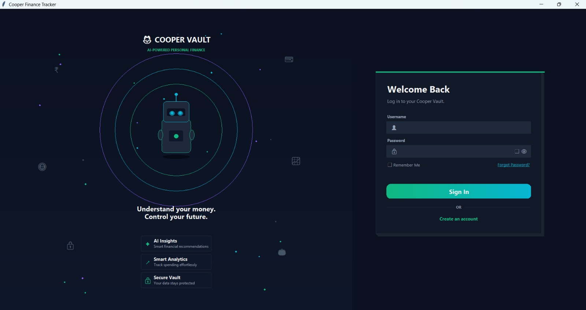
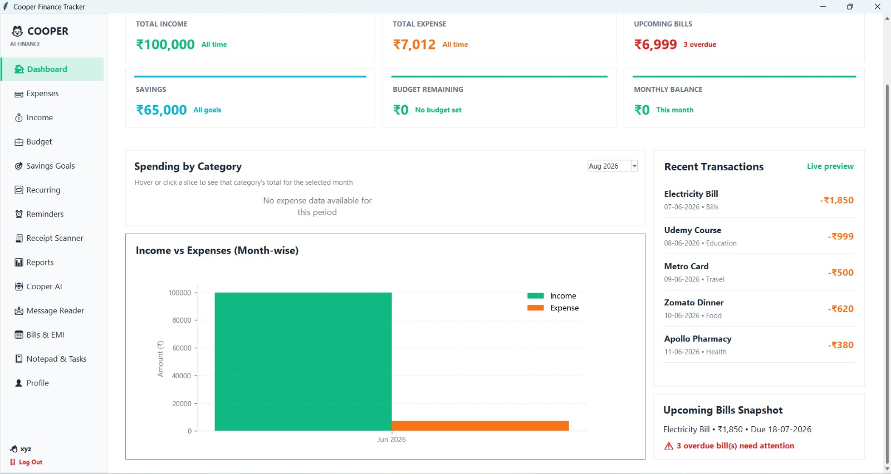
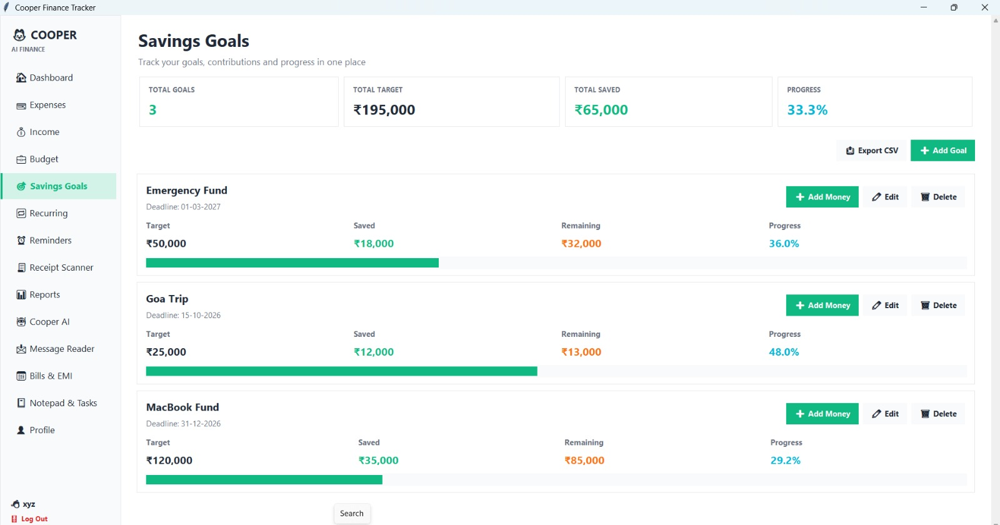
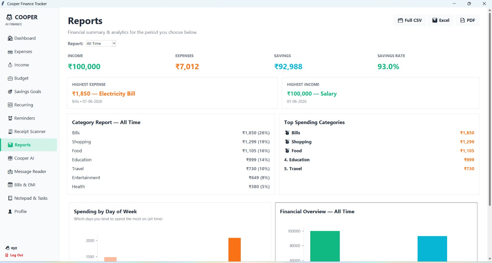
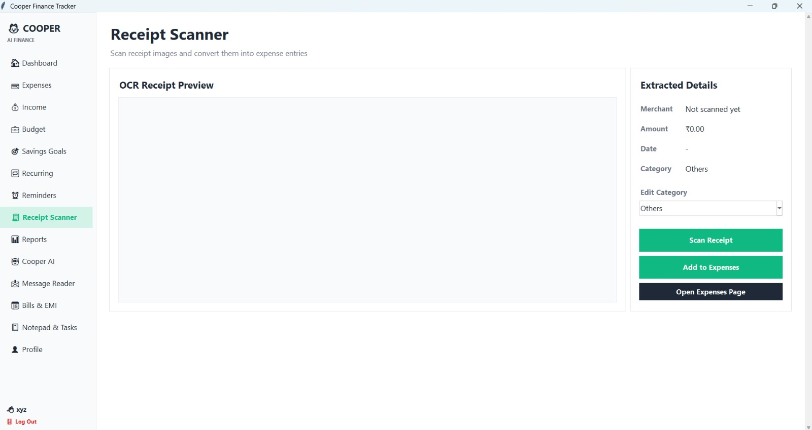
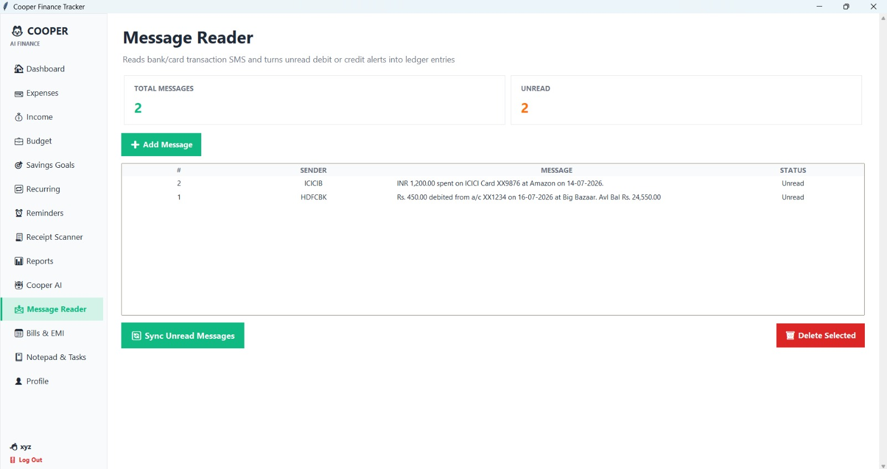
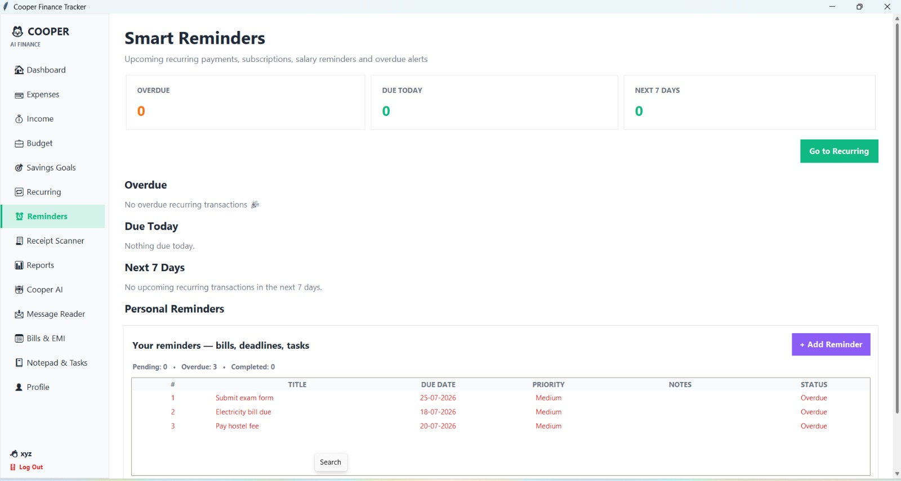

# Cooper Vault

A personal finance desktop application built with **Python, Tkinter, and SQLite** — expense/income tracking, budgeting, savings goals, bills & EMI management, and simple AI-style financial insights, wrapped in a dark "Midnight Emerald" FinTech-style UI with per-user data isolation.

## Overview

Cooper Vault is a single-desktop-app personal finance manager. Each person registers their own account and gets a completely private, isolated database — nothing is shared or synced between accounts. It's built for someone who wants a local, offline-first alternative to a spreadsheet: log expenses and income, set budgets, track savings goals, manage recurring bills, and get lightweight AI-style summaries of their own spending, all stored on their own machine.

## Features

- **Authentication** — registration with username-format validation, strong-password requirements (length, uppercase, lowercase, digit, special character), live password-strength indicator, case-insensitive duplicate-username checking, security-question password recovery, and a "Remember Me" auto-login option.
- **Dashboard** — spending-by-category chart, monthly income vs. expense chart, recent transactions, upcoming bills snapshot, and quick summary cards.
- **Expenses** — add/search/filter by category, CSV export.
- **Income** — add/search/filter by source, summary cards (total, this month, monthly average, growth), CSV export.
- **Budgets** — per-category monthly budgets with spend tracking and near-limit warnings.
- **Savings Goals** — target amount, contributions, progress bar, deadline tracking.
- **Recurring Transactions** — weekly/monthly recurring income or expenses with automatic due-date rollover.
- **Reminders** — due-date reminders with priority and status.
- **Bills & EMI** — due dates, paid/unpaid status, duplicate-bill merging.
- **Receipt Scanner** — OCR-based receipt text extraction (via `easyocr`) with automatic category suggestion from merchant name.
- **Reports** — category breakdowns, weekday spending patterns, period comparisons, PDF/Excel/CSV export.
- **Cooper AI** — a lightweight, rules-based assistant that answers questions about the user's own data (spending, savings rate, budget status) and surfaces daily insights — not a hosted/cloud AI model.
- **Message Reader** — parses simulated bank SMS/alert text into structured transaction suggestions.
- **Notepad & Tasks** — freeform notes and a simple to-do list.
- **Profile** — display name/email/phone/monthly income, profile picture, dark mode toggle, database backup/restore.

## Technology Stack

- Python 3
- Tkinter / ttk (GUI)
- SQLite (`sqlite3`, standard library)
- Matplotlib (dashboard & report charts)
- Optional: `easyocr` (receipt OCR), `reportlab` (PDF export), `openpyxl` (Excel export)

## Architecture

```
Login / Registration (data/users.db — auth only)
            │
            ▼
   get_user_db(username)
            │
            ▼
data/cooper_<username>.db  (that user's private database)
            │
            ▼
   Feature pages (Expenses, Income, Budgets, Savings
   Goals, Recurring, Reminders, Bills & EMI, Notes, ...)
            │
            ▼
   Reports / Cooper AI insights (computed only from
   the currently logged-in user's own database)
```

Every add/edit/delete/report function reads and writes through a single pair of module-level `conn`/`cursor` references. These are re-pointed at the correct user's private SQLite file the moment a login or registration succeeds, so every existing page automatically operates on the right account's data with no per-query filtering logic required.

## Database Architecture

- **`data/users.db`** — a single shared database holding *only* authentication and profile data (username, password hash + salt, security question, display name, email, phone, dark-mode preference). It never stores a single financial transaction.
- **`data/cooper_<username>.db`** — one private SQLite file per registered account, created empty on first registration, containing that user's `expenses`, `income`, `budgets`, `savings_goals`, `recurring_transactions`, `reminders`, `bills_emi`, `system_streaks`, `messages`, `todos`, and `notes` tables.
- Passwords are never stored in plain text — each password is hashed with a per-user random salt (`hashlib.sha256(salt + password)`).
- On logout, the current user's database connection is closed and cleared before returning to the login screen, so there is never a stale connection pointing at the previous account's data.

## Installation

```bash
pip install -r requirements.txt
```

`easyocr`, `reportlab`, and `openpyxl` are optional — the app runs fully without them, and only the Receipt Scanner / PDF export / Excel export features will show an install hint if you try to use them without the package installed.

## Running the Application

```bash
python main.py
```

On first launch, the app creates the `data/` folder and an empty `data/users.db` automatically. The first screen is registration (no accounts exist yet); after that, it's the login screen.

## Screenshots

### 🔐 Login


### 🏠 Dashboard


### 🎯 Savings Goals


### 📊 Reports


### 🧾 Receipt Scanner


### 📩 Message Reader


### ⏰ Reminders


## Future Scope

- Cloud sync / multi-device access (currently fully local/offline by design)
- CSV/bank-statement import for automatic expense entry
- Multi-currency support
- Scheduled/automatic backups

## License

See `LICENSE`.
